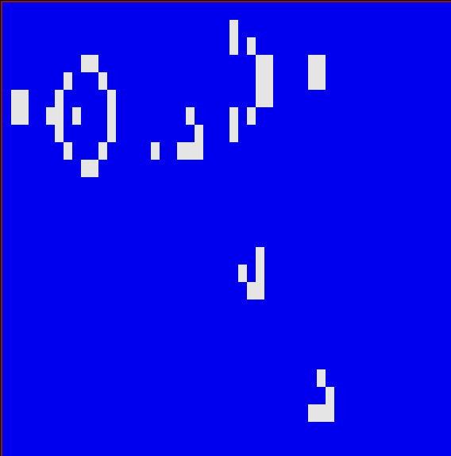

# Conway's Game of Life in Python

[model.py](model.py) holds the cell and universe classes that describe the
cellular automata.

[run_curses.py](run_curses.py) uses ncurses for a nice console rendering of the
simulation.

	usage: run_curses.py [-h] [--width WIDTH] [--height HEIGHT] [--bpm BPM]
						 [--init INIT]

	Curses version of Conway's Game of Life. Enjoy!

	optional arguments:
	  -h, --help       show this help message and exit
	  --width WIDTH    Universe width
	  --height HEIGHT  Universe height.
	  --bpm BPM        Beats per minute
	  --init INIT      CSV initial state

Try, for example, the included "gun.csv".

